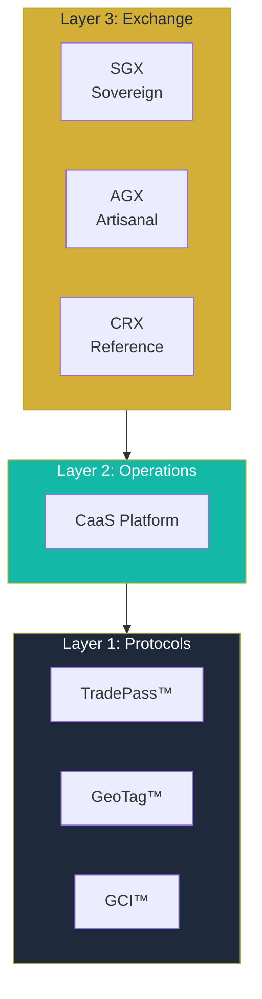
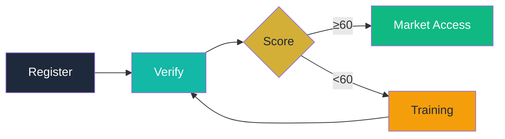
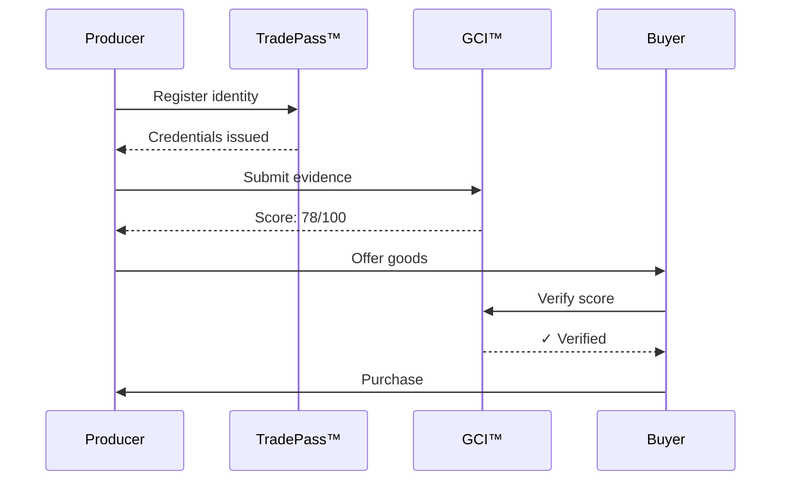
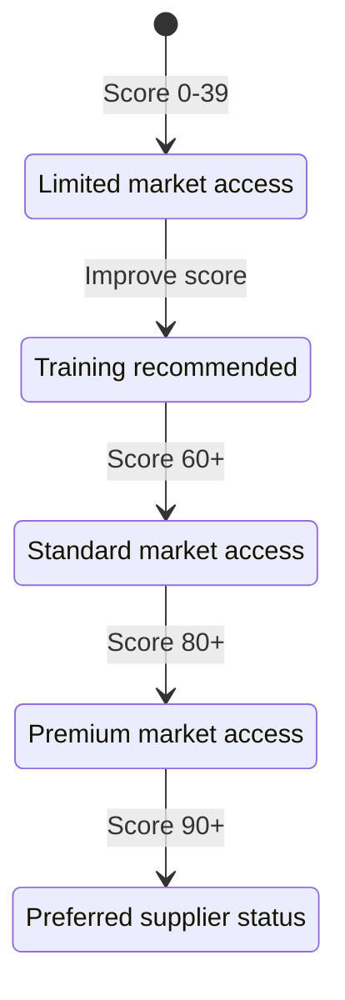

# GTCX Documentation Visual System

> Quick Reference: Components, Patterns, and Examples

## How to Use

- Use this as a visual checklist during doc creation.
- Apply callout and table patterns consistently.

## 1. Hero Diagrams Library

### The Must-Have Diagrams

Every GitBook needs these 5 hero diagrams ready before launch:

| #   | Diagram                               | GitBook         | Purpose                   |
| --- | ------------------------------------- | --------------- | ------------------------- |
| 1   | **Three-Tier Architecture**           | Protocol        | Core system understanding |
| 2   | **Permission → Proof Transformation** | Protocol, Civic | Value proposition         |
| 3   | **GCI Score Meter**                   | ComplianceOS    | Scoring visualization     |
| 4   | **Verification Journey**              | ComplianceOS    | User flow                 |
| 5   | **Revenue Recovery Model**            | Civic           | Government benefits       |

## 2. Callout Box Patterns

### GitBook Hint Syntax

```markdown

**Understanding Context:** Helpful background information.



**Best Practice:** Recommended approach based on experience.



**Important:** Something to be aware of before proceeding.



**Critical:** Must read to avoid serious issues.

```

### When to Use Each

| Type        | Trigger                         | Example                                               |
| ----------- | ------------------------------- | ----------------------------------------------------- |
| **Info**    | Background context, definitions | "TradePass uses W3C Verifiable Credentials..."        |
| **Success** | Best practices, pro tips        | "For best results, capture GeoTag during daylight..." |
| **Warning** | Gotchas, considerations         | "Offline mode requires pre-synced credentials..."     |
| **Danger**  | Breaking changes, security      | "Never share your API keys in client-side code..."    |

## 3. Table Patterns

### Feature Comparison Table

```markdown
| Feature          | Tier 1 | Tier 2 | Tier 3 |
| ---------------- | :----: | :----: | :----: |
| Basic Identity   |   ✅   |   ✅   |   ✅   |
| GCI Scoring      |   ❌   |   ✅   |   ✅   |
| API Access       |   ❌   |   ❌   |   ✅   |
| Priority Support |   ❌   |   ❌   |   ✅   |
```

**Renders as:**

| Feature          |  Tier 1   |  Tier 2   | Tier 3 |
| ---------------- | :-------: | :-------: | :----: |
| Basic Identity   |  [Done]   |  [Done]   | [Done] |
| GCI Scoring      | [Missing] |  [Done]   | [Done] |
| API Access       | [Missing] | [Missing] | [Done] |
| Priority Support | [Missing] | [Missing] | [Done] |

### Before/After Table

```markdown
| Metric             | Before GTCX | After GTCX | Improvement       |
| ------------------ | ----------- | ---------- | ----------------- |
| Market access time | 6-12 months | 48 hours   | **99% faster**    |
| Value captured     | 30-60%      | 85-95%     | **+50% income**   |
| Compliance cost    | $5,000+     | $0-50      | **99% reduction** |
```

### Protocol Mapping Table

```markdown
| Protocol       | Function   | Input                  | Output                   |
| -------------- | ---------- | ---------------------- | ------------------------ |
| **TradePass™** | Identity   | Documents, biometrics  | Verifiable credentials   |
| **GeoTag™**    | Provenance | Location data, photos  | Tamper-proof coordinates |
| **GCI™**       | Compliance | Evidence, attestations | Score 0-100              |
```

## 4. Code Block Patterns

### Multi-Language Tab

`

````markdown



```typescript
import \{ GTCX \} from '@gtcx/sdk';

const client = new GTCX(\{
  apiKey: process.env.GTCX_API_KEY,
\});

const identity = await client.tradepass.create({
  type: 'producer',
  jurisdiction: 'GH',
});
```
````

`

````




```python
from gtcx import GTCX

client = GTCX(api_key=os.environ['GTCX_API_KEY'])

identity = client.tradepass.create(
    type='producer',
    jurisdiction='GH'
)
````





```bash
curl -X POST https://api.gtcx.trade/v1/identities \
  -H "Authorization: Bearer $GTCX_API_KEY" \
  -H "Content-Type: application/json" \
  -d '{
    "type": "producer",
    "jurisdiction": "GH"
  }'
```


{% endtabs %
`

````

### Request/Response Pairs

```markdown
**Request:**
```json
POST /v1/gci/score
{
  "identity_id": "tp_abc123",
  "evidence": ["ev_001", "ev_002"]
}
`
````

**Response:**

```json
{
  "score": 78,
  "breakdown": {
    "legal_compliance": 85,
    "environmental": 72,
    "health_safety": 80
  },
  "recommendations": [...]
}
`
`
```

## 5. Expandable Sections

### GitBook Syntax

```markdown
<details>
<summary><strong>Click to expand: Technical Details</strong></summary>

Detailed technical information that most users don't need
on first read, but power users want access to.

- Deep dive point 1
- Deep dive point 2
- Deep dive point 3

</details>
`
```

### When to Use

| Use Case             | Example                              |
| -------------------- | ------------------------------------ |
| Technical deep dives | Cryptographic implementation details |
| Edge cases           | Handling offline conflicts           |
| Historical context   | Why we chose X over Y                |
| Full examples        | Complete code samples                |

## 6. Visual Density Standards

### Target: One Visual Every 300-500 Words

**Visual Types (in order of preference):**

1. **Diagrams** - Architecture, flows, relationships
2. **Tables** - Comparisons, mappings, specifications
3. **Code blocks** - Examples, API calls
4. **Screenshots** - UI elements, step-by-step
5. **Callout boxes** - Warnings, tips, notes
6. **Icons/badges** - Status indicators, quick reference

### Page Audit Template

```
PAGE: [Page Title]
WORD COUNT: [###]
VISUALS NEEDED: [word_count / 400]

CURRENT VISUALS:
☐ Diagrams:
☐ Tables:
☐ Code blocks:
☐ Screenshots:
☐ Callouts:

GAP: [current vs needed]
ACTION: [what to add]
```

## 7. Icon Usage

### Protocol Icons (Consistent Across All Docs)

| Protocol    | Emoji | Unicode Alt | Usage                 |
| ----------- | ----- | ----------- | --------------------- |
| TradePass   |       | [ID]        | Identity references   |
| GeoTag      |       | [PIN]       | Location references   |
| GCI         |       | [CHART]     | Compliance references |
| VaultMark   |       | [LOCK]      | Custody references    |
| PvP         |       | [SWAP]      | Settlement references |
| PANX Oracle |       | [SIGNAL]    | Consensus references  |

### Status Icons

| Status   | Emoji     | Unicode Alt | Usage             |
| -------- | --------- | ----------- | ----------------- |
| Complete | [Done]    | [OK]        | Success, verified |
| Pending  | [Pending] | [WAIT]      | In progress       |
| Failed   | [Missing] | [X]         | Error, rejected   |
| Warning  | [Partial] | [!]         | Attention needed  |
| Info     |           | [i]         | Note, context     |
| Tip      |           | [*]         | Best practice     |

## 8. Screenshot Standards

### Capture Settings

```
RESOLUTION: 2x (Retina)
BROWSER: Chrome (latest)
WINDOW SIZE: 1280x800 (standard viewport)
THEME: Light mode (unless showing dark theme feature)
FONTS: System fonts loaded
DATA: Realistic but non-sensitive
```

### Annotation Style

```
CALLOUT COLOR: #F43F5E (Rose-500)
CALLOUT STYLE: Rounded rectangle or circle
NUMBER STYLE: White text on rose background
ARROW STYLE: 2px stroke, rounded ends
TEXT LABELS: 14px, medium weight, white on rose
```

### File Naming

```
PATTERN: [section]-[feature]-[step]-[description].webp

EXAMPLES:
✓ tradepass-registration-step-1-enter-details.webp
✓ gci-dashboard-score-breakdown.webp
✓ agx-mobile-offline-sync-indicator.webp

✗ screenshot1.png
✗ IMG_2847.jpg
✗ Screen Shot 2024-01-15.png
```

## 9. Navigation Components

### Audience Selector Card Grid

```markdown
## Getting Started

<table>
<tr>
<td width="50%">

### 👩‍💻 For Developers

Build with GTCX protocols.

**Start here:** [Quick Start Guide](#)

</td>
<td width="50%">

### 🏛️ For Governments

Deploy sovereign infrastructure.

**Start here:** [Government Guide](#)

</td>
</tr>
<tr>
<td width="50%">

### 🤝 For Partners

Integrate with GTCX exchanges.

**Start here:** [Partner Guide](#)

</td>
<td width="50%">

### 🤖 For AI Agents

Onboard to the ecosystem.

**Start here:** [AI Agent Guide](#)

</td>
</tr>
</table>
```

### Next Steps Footer

```markdown
---

## Next Steps

| Action                | Link                            |
| --------------------- | ------------------------------- |
| **Continue learning** | [Next concept in series](#)  |
| **Try it yourself**   | [Interactive tutorial](#)    |
| **Go deeper**         | [Technical specification](#) |
| **Get help**          | [Community support](#)       |
```

## 10. Quality Checklist

### Before Publishing Any Page

```markdown
## Content ✓

- [ ] Title clearly describes content
- [ ] First paragraph answers "what is this?"
- [ ] Follows inverted pyramid (important first)
- [ ] All acronyms defined on first use
- [ ] Technical terms linked to glossary

## Visuals ✓

- [ ] Visual every 300-500 words
- [ ] All images have alt text
- [ ] Diagrams follow style guide
- [ ] Screenshots annotated consistently
- [ ] Code blocks syntax-highlighted

## Structure ✓

- [ ] Proper heading hierarchy (H1→H2→H3)
- [ ] No heading skips (H2→H4)
- [ ] Scannable with headings/bullets
- [ ] Tables for comparisons
- [ ] Callout boxes for important info

## Navigation ✓

- [ ] Logical position in sidebar
- [ ] Related pages linked
- [ ] Next steps at end
- [ ] Cross-GitBook links work

## Technical ✓

- [ ] All code examples tested
- [ ] API examples return expected results
- [ ] All links working
- [ ] Images optimized (<200KB)
- [ ] Page loads <3 seconds
```

## 11. Mermaid Diagram Templates

### Architecture (Layer Cake)



### Process Flow



### Sequence Diagram



### State Diagram (GCI Score States)



## 12. ASCII Diagram Templates

For environments where Mermaid isn't available:

### Box Diagram

```
┌─────────────────────────────────────────────────────────────────┐
│                         TITLE HERE                               │
├─────────────────────────────────────────────────────────────────┤
│                                                                  │
│   ┌─────────────┐    ┌─────────────┐    ┌─────────────┐        │
│   │   Box 1     │───►│   Box 2     │───►│   Box 3     │        │
│   │             │    │             │    │             │        │
│   └─────────────┘    └─────────────┘    └─────────────┘        │
│                                                                  │
└─────────────────────────────────────────────────────────────────┘
```

### Layered Architecture

```
┌─────────────────────────────────────────────────────────────────┐
│  LAYER 3: EXCHANGE                                               │
│  ┌─────────┐ ┌─────────┐ ┌─────────┐ ┌─────────┐ ┌─────────┐   │
│  │   SGX   │ │   AGX   │ │   CRX   │ │Pathways │ │ Veritas │   │
│  └────┬────┘ └────┬────┘ └────┬────┘ └────┬────┘ └────┬────┘   │
├───────┼──────────┼──────────┼──────────┼──────────┼─────────────┤
│  LAYER 2: OPERATIONS                                             │
│       │          │          │          │          │             │
│  ┌────┴──────────┴──────────┴──────────┴──────────┴────┐        │
│  │                    CaaS Platform                      │        │
│  └─────────────────────────┬────────────────────────────┘        │
├────────────────────────────┼────────────────────────────────────┤
│  LAYER 1: PROTOCOLS        │                                     │
│  ┌─────────┐ ┌─────────┐ ┌─┴───────┐ ┌─────────┐ ┌─────────┐   │
│  │TradePass│ │ GeoTag  │ │  GCI    │ │VaultMark│ │   PvP   │   │
│  └─────────┘ └─────────┘ └─────────┘ └─────────┘ └─────────┘   │
└─────────────────────────────────────────────────────────────────┘
```

### Comparison Layout

```
┌─────────────────────────────┬─────────────────────────────┐
│         BEFORE              │           AFTER             │
├─────────────────────────────┼─────────────────────────────┤
│                             │                             │
│  • Problem point 1          │  ✓ Solution point 1        │
│  • Problem point 2          │  ✓ Solution point 2        │
│  • Problem point 3          │  ✓ Solution point 3        │
│                             │                             │
│  Result: Bad outcome        │  Result: Good outcome       │
│                             │                             │
└─────────────────────────────┴─────────────────────────────┘
```

_GTCX Documentation Visual System v1.0_
