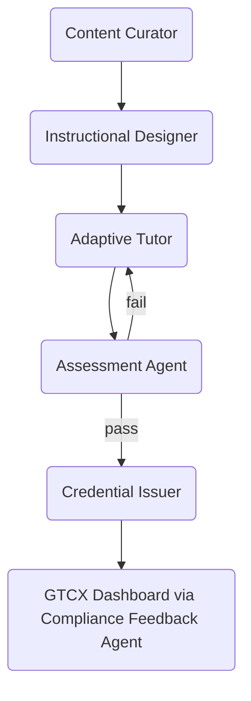

## Executive Summary

> **Status:** Current

# Deployment + Agentic AI

> **Status:** Current
> **Date:** 2026-05-22
> **Owner:** Protocol Architect

1. **Generate and personalize learning material**
2. **Assess competency in real time**
3. **Issue, store, and revoke credentials automatically**
4. **Feed results back into GTCX rule‑packs and dashboards**

#### 1. Agent Types & Roles

<table><thead><tr><th width="159.25390625">Agent</th><th width="218.55078125">Primary Function</th><th>Tech Stack (example)</th><th>Interactions</th></tr></thead><tbody><tr><td><strong>Content Curator Agent</strong></td><td>Ingests regulatory updates, maps new clauses to existing lessons, drafts micro‑modules</td><td>Retrieval‑augmented LLM (RAG) + vector DB</td><td>Pulls source PDFs  proposes lesson deltas for L&#x26;D review</td></tr><tr><td><strong>Instructional Designer Agent</strong></td><td>Converts curated content into SCORM / mobile‑app lessons with plain‑language explanations, field examples, and multimedia</td><td>LLM + XML/JSON template generator</td><td>Collaborates with human SME for sign‑off</td></tr><tr><td><strong>Adaptive Tutor Agent</strong></td><td>Delivers lessons, answers learner questions in local language, detects confusion, recommends remediation</td><td>LLM fine‑tuned on domain Q&#x26;A + on‑device speech recognition (offline)</td><td>Chat / voice with miners on Android hand‑held</td></tr><tr><td><strong>Assessment Agent</strong></td><td>Generates randomized question pools, grades micro‑assessments, flags suspicious patterns</td><td>LLM with question generator + rules for Bloom levels</td><td>API emits pass/fail + confidence score</td></tr><tr><td><strong>Credential Issuer Agent</strong></td><td>Mints W3C Verifiable Credentials, signs with GTCX CA, pushes to learner wallet</td><td>Credential API + custodian key store</td><td>Listens to Assessment Agent events</td></tr><tr><td><strong>Compliance Feedback Agent</strong></td><td>Feeds aggregated training KPIs back into GTCX dashboards; suggests rule‑pack tweaks if non‑compliance persists</td><td>Analytics service + LLM summary</td><td>Posts “training gaps” alerts to regulator dashboard</td></tr></tbody></table>

#### 2. Learning Flow with Agent Orchestration

1. **Curate:** New rule arrives (e.g., LBMA v10 clause). Curator Agent scrapes & tags it.
2. **Design:** Designer Agent drafts a micro‑lesson and pushes to LMS/mobile app.
3. **Tutor:** Learner interacts with Adaptive Tutor Agent (voice or text).
4. **Assess:** Assessment Agent generates randomised questions; if < 80 % score, loops learner back.
5. **Issue:** On pass, Credential Issuer Agent mints a VC and stores DOI in GTCX.
6. **Feedback:** Training uptake & failure metrics flow back to regulator dashboards.

#### 3. Governance & Safety Rails

<table><thead><tr><th width="158.9609375">Risk</th><th>Mitigation</th></tr></thead><tbody><tr><td><strong>Hallucination / wrong advice</strong></td><td>Human SME review queue for Curator &#x26; Designer outputs; Tutor limited to vetted knowledge base</td></tr><tr><td><strong>Credential fraud</strong></td><td>On‑device biometric verification before exam; VC signed by HSM key</td></tr><tr><td><strong>Data privacy</strong></td><td>Edge processing for voice; only hashed telemetry uplinked</td></tr><tr><td><strong>Agent drift</strong></td><td>Weekly regression tests against golden Q&#x26;A pairs; automatic rollback</td></tr></tbody></table>

#### 4. Implementation Milestones

<table><thead><tr><th width="107.9453125">Quarter</th><th>Deliverable</th></tr></thead><tbody><tr><td><strong>Q1 FY26</strong></td><td>PoC: Curator + Designer agents auto‑generate 5 micro‑lessons; human SME acceptance  90 %</td></tr><tr><td><strong>Q2 FY26</strong></td><td>Deploy Adaptive Tutor in 2 languages (EN / FR) to 100 miners; collect feedback</td></tr><tr><td><strong>Q3 FY26</strong></td><td>Assessment + Credential Issuer agents live; first 500 “Verified Producer” VCs issued</td></tr><tr><td><strong>Q4 FY26</strong></td><td>Compliance Feedback Agent integrated; dashboard shows training‑driven drop in rule violations</td></tr></tbody></table>

#### 5. Tech Foundation Choices

- <mark style="background-color:yellow;">**Orchestrator:**</mark> LangChain / LlamaIndex to coordinate multi‑agent workflows
- <mark style="background-color:yellow;">**Models:**</mark> Open‑source LLM (e.g., Mixtral) fine‑tuned on mining/compliance docs
- <mark style="background-color:yellow;">**Edge Runtime:**</mark> ONNX or GGUF‑quantized model for offline field tablets
- <mark style="background-color:yellow;">**Credential Layer:**</mark> DIDKit or Trinsic for VC issuance & wallet QR codes
- <mark style="background-color:yellow;">**Safety Layer:**</mark> Guardrails.ai templates + deterministic regex filters

## Negative Scope

This document does **not** cover:

- **VIA/VXA API specifications** (REST endpoints, authentication flows, evidence submission schemas): See [VIA/VXA — API & Security](via-vxa-api-security.md)
- **Enterprise platform pricing and deployment options** (SaaS tiers, on-premise, data residency): See [Product VXA Enterprise](product-vxa-enterprise.md)
- **Agentic AI system architecture** (LangChain/LangGraph orchestration, vector DB design): See [Agentic AI Architecture](agentic-ai-architecture.md)
