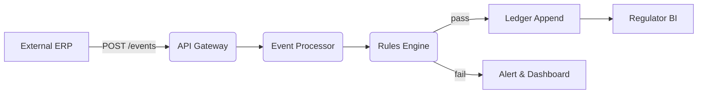

# Appendix D — API & Integration Guidelines


## Overview

**Appendix D — API & Integration Guidelines**

> **Purpose:** Provide developers, system integrators, and regulatory IT teams with explicit technical guidance for integrating external systems with the Global Trust & Compliance Exchange (GTCX). This appendix covers authentication, versioning, endpoint catalogues, data schemas, and reference workflows.

---

### 1. API Fundamentals

| Property         | Specification                             |
| ---------------- | ----------------------------------------- |
| **Protocol**     | HTTPS / TLS 1.3 (mandatory)               |
| **Styles**       | REST (OpenAPI 3.1) + gRPC (proto v4)      |
| **Auth**         | OAuth 2.1 (RFC 6749) ‑ Client Creds flow  |
| **Token Format** | JWT (RS‑256, 60 min TTL)                  |
| **Pagination**   | Cursor‑based (`next_cursor`)              |
| **Content‑Type** | `application/json; charset=utf-8`         |
| **Rate Limits**  | Default 1 000 req / min / client          |
| **Versioning**   | URI prefix (`/v1/`) + `X-API-Version` hdr |

---

### 2. Endpoint Catalogue (REST)

#### 2.1 Identity & Auth

| Method | Endpoint          | Description                                  |
| ------ | ----------------- | -------------------------------------------- |
| POST   | `/v1/oauth/token` | Obtain JWT access token (client credentials) |
| GET    | `/v1/whoami`      | Return claims of current token (debug)       |

#### 2.2 Field Event Ingest

| Method | Endpoint            | Description                                         |
| ------ | ------------------- | --------------------------------------------------- |
| POST   | `/v1/events`        | Submit signed field event (Geo‑tag, custody, assay) |
| GET    | `/v1/events/\{id\}` | Retrieve event detail & verification status         |
| GET    | `/v1/events`        | List events (filter by date, actor, type)           |

#### 2.3 Compliance Rules

| Method | Endpoint             | Description                                              |
| ------ | -------------------- | -------------------------------------------------------- |
| GET    | `/v1/rules`          | Fetch active rule pack metadata                          |
| POST   | `/v1/rules/validate` | Dry‑run payload vs rule pack; returns pass/fail & detail |

#### 2.4 Audit & Ledger

| Method | Endpoint              | Description                                    |
| ------ | --------------------- | ---------------------------------------------- |
| GET    | `/v1/ledger/\{hash\}` | Retrieve merkle branch proof for audit record  |
| GET    | `/v1/ledger/export`   | Export time‑bounded audit slice (CSV or JSONL) |

#### 2.5 Reporting & Dashboards

| Method | Endpoint                          | Description                                   |
| ------ | --------------------------------- | --------------------------------------------- |
| GET    | `/v1/metrics/overview`            | Summary KPIs (ingest rate, rule violations)   |
| GET    | `/v1/metrics/actors/\{actor_id\}` | Compliance score & history for specific actor |

---

### 3. gRPC Service Definitions (Excerpt)

```proto
syntax = "proto3";

package gtcx.events.v1;

service EventIngest {
  rpc Submit (SignedEvent) returns (SubmitResponse) {}
  rpc BatchSubmit (stream SignedEvent) returns (BatchAck) {}
}

message SignedEvent {
  string id          = 1;
  string actor_id    = 2;
  int64  timestamp   = 3;  // Unix epoch ms
  bytes  payload     = 4;  // JSON‑encoded event body
  bytes  signature   = 5;  // Ed25519 signature of payload
}
```

Full `.proto` files available in GTCX SDK repo.

---

### 4. Authentication & Security Workflow

1. **Client Registration** — Regulator IT issues `client_id` / `client_secret` (+ public key) via admin console.
2. **Token Request** — External system posts to `/oauth/token` with `grant_type=client_credentials`.
3. **JWT Claims** — Access token includes `sub` (actor ID), `scope` (list), `iat`, `exp`.
4. **Request Signing** — Field devices additionally sign event body using Ed25519; signature passed in `X-Signature` header.
5. **API Gateway** — Validates JWT, rate‑limits, forwards to micro‑service; body signature verified in event‑processor.

---

### 5. Data Schemas

#### 5.1 Event Payload (Geo‑Tag example)

```json
{
  "event_type": "geo_tag",
  "actor_id": "AGX‑A1234",
  "timestamp": 1717575300,
  "geo": {
    "lat": 6.6013,
    "lng": -0.4813,
    "accuracy_m": 4.2
  },
  "lot": {
    "lot_id": "LOT‑2025‑06‑06‑001",
    "mass_g": 1234.56
  }
}
```

#### 5.2 Rule Violation Response

```json
{
  "status": "fail",
  "violations": [
    {
      "rule_id": "AML‑001",
      "severity": "high",
      "message": "Actor not in whitelist"
    }
  ]
}
```

---

### 6. Reference Integration Workflow



_Mermaid diagram illustrates the path of an event from external ERP into compliance pipeline._

---

### 7. SDK & Tooling

| Language   | Package                  | Install                    |
| ---------- | ------------------------ | -------------------------- |
| Go         | `github.com/gtcx/sdk-go` | `go get ...`               |
| Python     | `gtcx-sdk` (PyPI)        | `pip install gtcx-sdk`     |
| JavaScript | `@gtcx/sdk-js` (npm)     | `npm install @gtcx/sdk-js` |

SDKs provide typed client, request signing helpers, and retry logic.

---

### 8. Error Codes

| Code    | HTTP | Meaning                   |
| ------- | ---- | ------------------------- |
| `E1000` | 400  | Schema validation failed  |
| `E2000` | 401  | Invalid/expired token     |
| `E3001` | 403  | Scope insufficient        |
| `E4004` | 404  | Resource not found        |
| `E5000` | 500  | Internal processing error |

---

### 9. Versioning & Deprecation Policy

- **Semantic API versions:** `/v1/`, `/v2/` etc.
- **Deprecation window:** 12 months; `Warning: Deprecation` header issued starting T‑12.
- **Change log:** `/v1/meta/changelog` endpoint lists breaking changes.

---

_End of Appendix D – API & Integration Guidelines_
