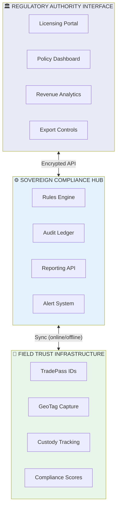
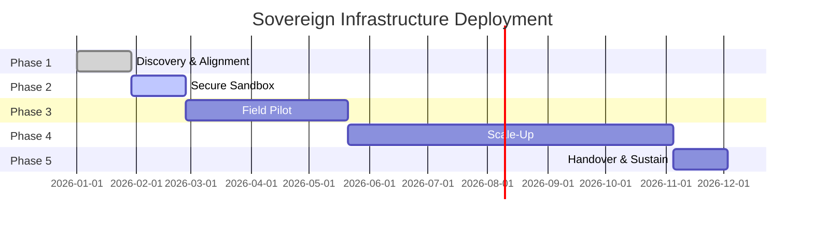
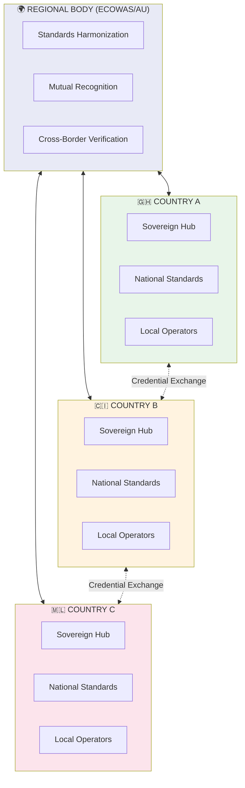

```mermaid
flowchart LR
    subgraph POLICY["📋 POLICY LAYER"]
        P1[National Standards]
        P2[Export Requirements]
        P3[Tax Regulations]
    end

    subgraph RULES["⚙️ RULES LAYER"]
        R1[JSON-Logic Policies]
        R2[Compliance Criteria]
        R3[Alert Thresholds]
    end

    subgraph FIELD["📱 FIELD LAYER"]
        F1[Identity Verification]
        F2[Location Capture]
        F3[Transaction Records]
    end

    subgraph ANALYTICS["📊 ANALYTICS LAYER"]
        A1[Compliance Scores]
        A2[Revenue Dashboards]
        A3[Risk Alerts]
    end

    POLICY --> RULES
    RULES --> FIELD
    FIELD --> ANALYTICS
    ANALYTICS --> POLICY

    style POLICY fill:#e8eaf6
    style RULES fill:#e3f2fd
    style FIELD fill:#e8f5e9
    style ANALYTICS fill:#fff3e0
```

# GTCX Civic Hero Diagrams

> **Architecture visualizations for GTCX Public Sector documentation**
> Version 1.0 | January 2026

---

## 1. Sovereign Architecture Stack

The three-tier architecture that maintains government control while enabling field-level verification.

### Mermaid Diagram



### ASCII Version

```
┌─────────────────────────────────────────────────────────────────────────────┐
│                    SOVEREIGN THREE-TIER ARCHITECTURE                         │
├─────────────────────────────────────────────────────────────────────────────┤
│                                                                              │
│  ┌───────────────────────────────────────────────────────────────────────┐  │
│  │              🏛️ REGULATORY AUTHORITY INTERFACE                        │  │
│  │                    (Government Control Layer)                          │  │
│  │  ┌─────────────┐ ┌─────────────┐ ┌─────────────┐ ┌─────────────┐     │  │
│  │  │  Licensing  │ │   Policy    │ │   Revenue   │ │   Export    │     │  │
│  │  │   Portal    │ │  Dashboard  │ │  Analytics  │ │  Controls   │     │  │
│  │  └─────────────┘ └─────────────┘ └─────────────┘ └─────────────┘     │  │
│  │                                                                        │  │
│  │  🔐 Government owns encryption keys | 🗄️ Data stays in-country       │  │
│  └───────────────────────────────────────────────────────────────────────┘  │
│                                    ▲                                         │
│                                    │ Encrypted REST/gRPC APIs               │
│                                    ▼                                         │
│  ┌───────────────────────────────────────────────────────────────────────┐  │
│  │                ⚙️ SOVEREIGN COMPLIANCE HUB                            │  │
│  │                   (Automated Enforcement Layer)                        │  │
│  │  ┌─────────────┐ ┌─────────────┐ ┌─────────────┐ ┌─────────────┐     │  │
│  │  │   Rules     │ │   Audit     │ │  Reporting  │ │   Alert     │     │  │
│  │  │   Engine    │ │   Ledger    │ │     API     │ │   System    │     │  │
│  │  └─────────────┘ └─────────────┘ └─────────────┘ └─────────────┘     │  │
│  │                                                                        │  │
│  │  ⚖️ JSON-Logic policies | 📊 Merkle audit trail | 🔔 Real-time alerts │  │
│  └───────────────────────────────────────────────────────────────────────┘  │
│                                    ▲                                         │
│                                    │ Sync (online + offline capable)        │
│                                    ▼                                         │
│  ┌───────────────────────────────────────────────────────────────────────┐  │
│  │              📱 FIELD TRUST INFRASTRUCTURE                            │  │
│  │                    (Data Capture Layer)                                │  │
│  │  ┌─────────────┐ ┌─────────────┐ ┌─────────────┐ ┌─────────────┐     │  │
│  │  │ TradePass™  │ │  GeoTag™    │ │  Custody    │ │ Compliance  │     │  │
│  │  │    IDs      │ │  Capture    │ │  Tracking   │ │   Scores    │     │  │
│  │  └─────────────┘ └─────────────┘ └─────────────┘ └─────────────┘     │  │
│  │                                                                        │  │
│  │  📴 Offline-first | 🌐 20+ languages | 📱 Feature phone compatible    │  │
│  └───────────────────────────────────────────────────────────────────────┘  │
│                                                                              │
└─────────────────────────────────────────────────────────────────────────────┘
```

---

## 2. Implementation Roadmap

The five-phase deployment timeline for sovereign infrastructure.

### Mermaid Diagram



### ASCII Version

```
┌─────────────────────────────────────────────────────────────────────────────┐
│                    IMPLEMENTATION ROADMAP                                    │
├─────────────────────────────────────────────────────────────────────────────┤
│                                                                              │
│  TIMELINE                                                                    │
│  ════════════════════════════════════════════════════════════════════════   │
│  │ Week 0        │ Week 4        │ Week 8        │ Week 20       │ Week 44  │
│  │               │               │               │               │          │
│  ▼               ▼               ▼               ▼               ▼          │
│                                                                              │
│  ┌───────────┐                                                              │
│  │    🔍     │  PHASE 1: DISCOVERY & ALIGNMENT (2-4 weeks)                 │
│  │ Discovery │  ─────────────────────────────────────────                   │
│  └───────────┘  • Stakeholder matrix development                            │
│       │         • Data model mapping                                        │
│       │         • Pilot MoU signing                                         │
│       │         ✓ Deliverable: Signed scope & KPI sheet                    │
│       ▼                                                                      │
│  ┌───────────┐                                                              │
│  │    🧪     │  PHASE 2: SECURE SANDBOX (4 weeks)                          │
│  │  Sandbox  │  ──────────────────────────────────                          │
│  └───────────┘  • Single-node Compliance Hub in staging VPC                 │
│       │         • Synthetic dataset loading                                  │
│       │         • Workflow validation with regulator                        │
│       │         ✓ Deliverable: Regulator acceptance of workflows           │
│       ▼                                                                      │
│  ┌───────────┐                                                              │
│  │    🚀     │  PHASE 3: FIELD PILOT (8-12 weeks)                          │
│  │   Pilot   │  ─────────────────────────────────                           │
│  └───────────┘  • 20-50 site onboarding                                     │
│       │         • Real data ingestion                                        │
│       │         • Rule-pack tuning based on field feedback                  │
│       │         ✓ Deliverable: ≥90% event capture, <5% false positive      │
│       ▼                                                                      │
│  ┌───────────┐                                                              │
│  │    📈     │  PHASE 4: SCALE-UP (3-6 months)                             │
│  │ Scale-Up  │  ──────────────────────────────                              │
│  └───────────┘  • Nationwide device rollout                                 │
│       │         • SLA dashboards live                                        │
│       │         • Integration with existing government systems              │
│       │         ✓ Deliverable: 95% target supply digitized                 │
│       ▼                                                                      │
│  ┌───────────┐                                                              │
│  │    🤝     │  PHASE 5: HANDOVER & SUSTAIN (4 weeks)                      │
│  │ Handover  │  ─────────────────────────────────────                       │
│  └───────────┘  • Operations playbooks delivered                            │
│                 • Disaster recovery drill completed                          │
│                 • Support contract signed                                    │
│                 ✓ Deliverable: Regulator signs production acceptance        │
│                                                                              │
│  ────────────────────────────────────────────────────────────────────────   │
│  📅 TOTAL TIMELINE: 6-12 months from kickoff to full production            │
│                                                                              │
└─────────────────────────────────────────────────────────────────────────────┘
```

---

## 3. Stakeholder Engagement Matrix

Who does what in sovereign infrastructure deployment.

### ASCII Version

```
┌─────────────────────────────────────────────────────────────────────────────┐
│                    STAKEHOLDER ENGAGEMENT MATRIX                             │
├─────────────────────────────────────────────────────────────────────────────┤
│                                                                              │
│  GOVERNMENT MINISTRIES                                                       │
│  ─────────────────────────────────────────────────────────────────────────  │
│                                                                              │
│  ┌────────────────────┐  ┌────────────────────┐  ┌────────────────────┐    │
│  │   ⛏️ MINISTRY OF   │  │   💰 MINISTRY OF   │  │   🚢 MINISTRY OF   │    │
│  │       MINES        │  │      FINANCE       │  │       TRADE        │    │
│  ├────────────────────┤  ├────────────────────┤  ├────────────────────┤    │
│  │ • Licensing        │  │ • Revenue tracking │  │ • Export controls  │    │
│  │ • Site registry    │  │ • Tax compliance   │  │ • Trade promotion  │    │
│  │ • Production data  │  │ • Royalty capture  │  │ • Market access    │    │
│  │ • Environmental    │  │ • Budget analytics │  │ • Regional trade   │    │
│  └────────────────────┘  └────────────────────┘  └────────────────────┘    │
│           │                       │                       │                 │
│           └───────────────────────┼───────────────────────┘                 │
│                                   ▼                                          │
│                    ┌──────────────────────────────┐                         │
│                    │    🏛️ INTER-MINISTERIAL      │                         │
│                    │      COORDINATION BODY       │                         │
│                    │    (Task Force / Committee)  │                         │
│                    └──────────────────────────────┘                         │
│                                   │                                          │
│           ┌───────────────────────┼───────────────────────┐                 │
│           ▼                       ▼                       ▼                 │
│                                                                              │
│  IMPLEMENTATION PARTNERS                                                     │
│  ─────────────────────────────────────────────────────────────────────────  │
│                                                                              │
│  ┌────────────────────┐  ┌────────────────────┐  ┌────────────────────┐    │
│  │   🏗️ DEVELOPMENT   │  │   👨‍💻 TECHNICAL     │  │   👥 CIVIL         │    │
│  │   FINANCE (DFI)    │  │   PARTNERS         │  │   SOCIETY          │    │
│  ├────────────────────┤  ├────────────────────┤  ├────────────────────┤    │
│  │ • Funding          │  │ • Implementation   │  │ • Community voice  │    │
│  │ • Technical assist │  │ • Training         │  │ • Grievance        │    │
│  │ • Best practices   │  │ • Support          │  │ • Monitoring       │    │
│  │ • M&E frameworks   │  │ • Integration      │  │ • Advocacy         │    │
│  └────────────────────┘  └────────────────────┘  └────────────────────┘    │
│                                                                              │
│  ─────────────────────────────────────────────────────────────────────────  │
│                                                                              │
│  FIELD ACTORS                                                                │
│  ─────────────────────────────────────────────────────────────────────────  │
│                                                                              │
│  ┌─────────────┐  ┌─────────────┐  ┌─────────────┐  ┌─────────────┐        │
│  │ ⛏️ Miners   │  │ 🏪 Traders  │  │ 🏭 Refiners │  │ 🚚 Exporters │        │
│  └─────────────┘  └─────────────┘  └─────────────┘  └─────────────┘        │
│                                                                              │
└─────────────────────────────────────────────────────────────────────────────┘
```

---

## 4. Policy-to-Field Information Flow

How policies translate into field-level compliance signals.

### Mermaid Diagram



### ASCII Version

```
┌─────────────────────────────────────────────────────────────────────────────┐
│                    POLICY-TO-FIELD INFORMATION FLOW                          │
├─────────────────────────────────────────────────────────────────────────────┤
│                                                                              │
│  📋 POLICY                 ⚙️ RULES                  📱 FIELD               │
│  ────────                  ──────                   ──────                   │
│                                                                              │
│  ┌─────────────┐          ┌─────────────┐         ┌─────────────┐          │
│  │  National   │          │  JSON-Logic │         │   Identity  │          │
│  │  Standards  │ ───────▶ │   Policies  │ ──────▶ │ Verification│          │
│  └─────────────┘          └─────────────┘         └─────────────┘          │
│        │                        │                       │                   │
│        ▼                        ▼                       ▼                   │
│  ┌─────────────┐          ┌─────────────┐         ┌─────────────┐          │
│  │   Export    │          │ Compliance  │         │   Location  │          │
│  │Requirements │ ───────▶ │  Criteria   │ ──────▶ │   Capture   │          │
│  └─────────────┘          └─────────────┘         └─────────────┘          │
│        │                        │                       │                   │
│        ▼                        ▼                       ▼                   │
│  ┌─────────────┐          ┌─────────────┐         ┌─────────────┐          │
│  │    Tax      │          │   Alert     │         │ Transaction │          │
│  │ Regulations │ ───────▶ │ Thresholds  │ ──────▶ │   Records   │          │
│  └─────────────┘          └─────────────┘         └─────────────┘          │
│                                                          │                  │
│                                                          │                  │
│  ◀──────────────────────────────────────────────────────┘                  │
│                         FEEDBACK LOOP                                        │
│                                                                              │
│                     📊 ANALYTICS OUTPUT                                      │
│                     ────────────────────                                     │
│                                                                              │
│        ┌─────────────────────────────────────────────────────┐             │
│        │                                                      │             │
│        │  ┌────────────┐  ┌────────────┐  ┌────────────┐    │             │
│        │  │ Compliance │  │  Revenue   │  │    Risk    │    │             │
│        │  │   Scores   │  │ Dashboards │  │   Alerts   │    │             │
│        │  │            │  │            │  │            │    │             │
│        │  │   78/100   │  │  $2.4M     │  │  3 Active  │    │             │
│        │  └────────────┘  └────────────┘  └────────────┘    │             │
│        │                                                      │             │
│        └─────────────────────────────────────────────────────┘             │
│                                                                              │
└─────────────────────────────────────────────────────────────────────────────┘
```

---

## 5. ESG Transformation Model

From periodic audits to continuous compliance infrastructure.

### ASCII Version

```
┌─────────────────────────────────────────────────────────────────────────────┐
│                    ESG TRANSFORMATION MODEL                                  │
│           "From Gatekeeping to Groundtruth"                                  │
├─────────────────────────────────────────────────────────────────────────────┤
│                                                                              │
│  ❌ TRADITIONAL ESG                     ✅ INFRASTRUCTURE ESG                │
│  ─────────────────                      ─────────────────────                │
│                                                                              │
│  ┌─────────────────────┐               ┌─────────────────────┐              │
│  │ Pass/Fail           │      ▶        │ Real-time Risk      │              │
│  │ Credential          │               │ Gradient            │              │
│  └─────────────────────┘               └─────────────────────┘              │
│                                                                              │
│  ┌─────────────────────┐               ┌─────────────────────┐              │
│  │ Annual/Ad-hoc       │      ▶        │ Persistent Field    │              │
│  │ Audits              │               │ Compliance Signals  │              │
│  └─────────────────────┘               └─────────────────────┘              │
│                                                                              │
│  ┌─────────────────────┐               ┌─────────────────────┐              │
│  │ Education as        │      ▶        │ Education as        │              │
│  │ Precondition        │               │ Continuous Process  │              │
│  └─────────────────────┘               └─────────────────────┘              │
│                                                                              │
│  ┌─────────────────────┐               ┌─────────────────────┐              │
│  │ Compliance as       │      ▶        │ Compliance as       │              │
│  │ Theory              │               │ Infrastructure      │              │
│  └─────────────────────┘               └─────────────────────┘              │
│                                                                              │
│  ┌─────────────────────┐               ┌─────────────────────┐              │
│  │ Suspicion of        │      ▶        │ Investment in       │              │
│  │ Informality         │               │ Professionalization │              │
│  └─────────────────────┘               └─────────────────────┘              │
│                                                                              │
│  ────────────────────────────────────────────────────────────────────────   │
│                                                                              │
│  THE CORE INSIGHT                                                            │
│  ────────────────                                                            │
│                                                                              │
│  ┌─────────────────────────────────────────────────────────────────────┐   │
│  │                                                                      │   │
│  │  "It is cheaper and more scalable to teach people how to comply    │   │
│  │   than to keep trying to catch them failing."                       │   │
│  │                                                                      │   │
│  │  📚 Education + 📱 Infrastructure + 📊 Data = 🏆 Sustainable ESG    │   │
│  │                                                                      │   │
│  └─────────────────────────────────────────────────────────────────────┘   │
│                                                                              │
└─────────────────────────────────────────────────────────────────────────────┘
```

---

## 6. Regional Interoperability Framework

How sovereign systems connect across borders.

### Mermaid Diagram



### ASCII Version

```
┌─────────────────────────────────────────────────────────────────────────────┐
│                    REGIONAL INTEROPERABILITY FRAMEWORK                       │
├─────────────────────────────────────────────────────────────────────────────┤
│                                                                              │
│                    ┌─────────────────────────────────┐                      │
│                    │    🌍 REGIONAL COORDINATION     │                      │
│                    │       (ECOWAS / AU / AfCFTA)    │                      │
│                    │                                  │                      │
│                    │  • Standards Harmonization      │                      │
│                    │  • Mutual Recognition Agreements │                      │
│                    │  • Cross-Border Verification    │                      │
│                    │  • Dispute Resolution           │                      │
│                    └───────────────┬─────────────────┘                      │
│                                    │                                         │
│          ┌─────────────────────────┼─────────────────────────┐              │
│          │                         │                         │              │
│          ▼                         ▼                         ▼              │
│  ┌───────────────────┐   ┌───────────────────┐   ┌───────────────────┐     │
│  │  🇬🇭 GHANA         │   │  🇨🇮 CÔTE D'IVOIRE │   │  🇲🇱 MALI          │     │
│  │                    │   │                    │   │                    │     │
│  │ ┌────────────────┐ │   │ ┌────────────────┐ │   │ ┌────────────────┐ │     │
│  │ │ Sovereign Hub  │ │   │ │ Sovereign Hub  │ │   │ │ Sovereign Hub  │ │     │
│  │ └────────────────┘ │   │ └────────────────┘ │   │ └────────────────┘ │     │
│  │         │          │   │         │          │   │         │          │     │
│  │ ┌────────────────┐ │   │ ┌────────────────┐ │   │ ┌────────────────┐ │     │
│  │ │National Rules  │ │   │ │National Rules  │ │   │ │National Rules  │ │     │
│  │ └────────────────┘ │   │ └────────────────┘ │   │ └────────────────┘ │     │
│  │         │          │   │         │          │   │         │          │     │
│  │ ┌────────────────┐ │   │ ┌────────────────┐ │   │ ┌────────────────┐ │     │
│  │ │Field Operators │ │   │ │Field Operators │ │   │ │Field Operators │ │     │
│  │ └────────────────┘ │   │ └────────────────┘ │   │ └────────────────┘ │     │
│  └─────────┬──────────┘   └─────────┬──────────┘   └─────────┬──────────┘     │
│            │                        │                        │              │
│            └────────────────────────┼────────────────────────┘              │
│                                     │                                        │
│                        ┌────────────┴────────────┐                          │
│                        │  CREDENTIAL EXCHANGE    │                          │
│                        │                         │                          │
│                        │  🔐 Portable Legitimacy │                          │
│                        │  ✅ Cross-Border Valid  │                          │
│                        │  📊 Unified Analytics   │                          │
│                        └─────────────────────────┘                          │
│                                                                              │
│  KEY PRINCIPLE: Each nation maintains full sovereignty while enabling       │
│                 seamless credential portability across borders              │
│                                                                              │
└─────────────────────────────────────────────────────────────────────────────┘
```

---

## 7. Policy Brief Stakeholder Map

Which documents for which audiences.

### ASCII Version

```
┌─────────────────────────────────────────────────────────────────────────────┐
│                    POLICY DOCUMENT NAVIGATION                                │
├─────────────────────────────────────────────────────────────────────────────┤
│                                                                              │
│  DOCUMENT TYPE          PRIMARY AUDIENCE           KEY FOCUS                 │
│  ─────────────          ────────────────           ─────────                 │
│                                                                              │
│  ┌─────────────┐       ┌─────────────────┐                                  │
│  │ 📋 PB-1     │ ────▶ │ ⛏️ Ministry of   │       Licensing, Digital         │
│  │ Policy Brief│       │    Mines        │       Mining Governance          │
│  └─────────────┘       └─────────────────┘                                  │
│                                                                              │
│  ┌─────────────┐       ┌─────────────────┐                                  │
│  │ 📋 PB-2     │ ────▶ │ 💰 Ministry of   │       Revenue, Tax               │
│  │ Policy Brief│       │    Finance      │       Compliance                  │
│  └─────────────┘       └─────────────────┘                                  │
│                                                                              │
│  ┌─────────────┐       ┌─────────────────┐                                  │
│  │ 📋 PB-3     │ ────▶ │ 🚢 Ministry of   │       Export Promotion,          │
│  │ Policy Brief│       │    Trade        │       Market Access               │
│  └─────────────┘       └─────────────────┘                                  │
│                                                                              │
│  ┌─────────────┐       ┌─────────────────┐                                  │
│  │ 📋 PB-4     │ ────▶ │ 🌍 Regional      │       Cross-Border,              │
│  │ Policy Brief│       │   Organizations │       Harmonization               │
│  └─────────────┘       └─────────────────┘                                  │
│                                                                              │
│  ┌─────────────┐       ┌─────────────────┐                                  │
│  │ 📋 PB-5     │ ────▶ │ 🏗️ Development   │       Investment, Impact          │
│  │ Policy Brief│       │   Finance       │       Measurement                 │
│  └─────────────┘       └─────────────────┘                                  │
│                                                                              │
│  ────────────────────────────────────────────────────────────────────────   │
│                                                                              │
│  ┌─────────────┐       ┌─────────────────┐                                  │
│  │ 💡 CP-1/2   │ ────▶ │ 👔 Senior       │       Strategic Vision,          │
│  │Concept Paper│       │   Policymakers  │       National Framework          │
│  └─────────────┘       └─────────────────┘                                  │
│                                                                              │
│  ┌─────────────┐       ┌─────────────────┐                                  │
│  │ 📄 TWP      │ ────▶ │ 👨‍💻 Technical    │       Architecture,              │
│  │ White Paper │       │   Teams         │       Implementation              │
│  └─────────────┘       └─────────────────┘                                  │
│                                                                              │
│  ┌─────────────┐       ┌─────────────────┐                                  │
│  │ 📘 Playbook │ ────▶ │ 👨‍⚖️ Regulators   │       Step-by-Step              │
│  │             │       │   + IT Teams    │       Deployment                  │
│  └─────────────┘       └─────────────────┘                                  │
│                                                                              │
└─────────────────────────────────────────────────────────────────────────────┘
```

---

## Quick Reference: Diagram Selection

| Concept             | Best Diagram              | Location           |
| ------------------- | ------------------------- | ------------------ |
| System architecture | §1 Sovereign Architecture | Technical overview |
| Project timeline    | §2 Implementation Roadmap | Project planning   |
| Who's involved      | §3 Stakeholder Matrix     | Partnership pages  |
| How data flows      | §4 Policy-to-Field        | Technical docs     |
| Why this approach   | §5 ESG Transformation     | ESG policy papers  |
| Cross-border        | §6 Regional Framework     | Regional briefs    |
| Find your doc       | §7 Document Navigation    | Landing page       |

---

_GTCX Civic Hero Diagrams v1.0 — January 2026_
