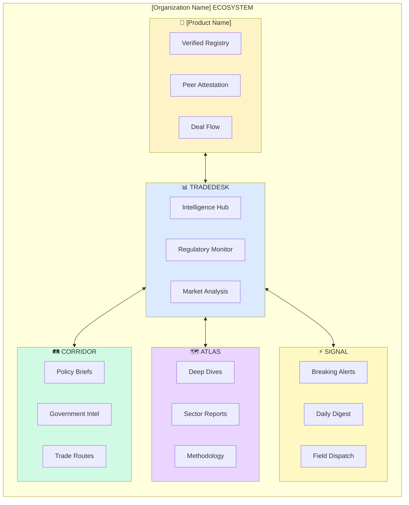
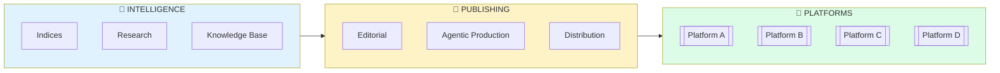

---

title: "[Organization Name] Hero Diagrams"
status: "current"
date: "2026-05-24"
owner: "quality-evidence-lead"
role: "quality-evidence-lead"
tier: "operating"
tags: ["testing"]
review_cycle: "annual"

---

# [Organization Name] Hero Diagrams

> **Architecture visualizations for media, intelligence, and platform documentation**
> Version 1.0 | January 2026

---

## 1. Platform Ecosystem

The five platforms of [Organization Name] and how they serve different needs.

### Mermaid Diagram



### ASCII Version

```
┌─────────────────────────────────────────────────────────────────────────────┐
│                       [Organization Name] PLATFORM ECOSYSTEM                         │
│                                                                              │
│              "Bloomberg + The Information + Reuters for                      │
│                      Commodity Verification"                                 │
├─────────────────────────────────────────────────────────────────────────────┤
│                                                                              │
│  ┌─────────────────────────────────────────────────────────────────────┐   │
│  │                         📊 TRADEDESK                                 │   │
│  │                    "Intelligence Hub"                                │   │
│  │                                                                       │   │
│  │   The central nervous system — where all intelligence converges     │   │
│  │                                                                       │   │
│  │   • Real-time regulatory monitoring                                  │   │
│  │   • Market analysis and signals                                      │   │
│  │   • Counterparty intelligence                                        │   │
│  │   • Custom alerts and watchlists                                     │   │
│  │                                                                       │   │
│  └──────────────────────────────┬──────────────────────────────────────┘   │
│                                 │                                           │
│         ┌───────────────────────┼───────────────────────┐                  │
│         │                       │                       │                  │
│         ▼                       ▼                       ▼                  │
│  ┌─────────────┐         ┌─────────────┐         ┌─────────────┐          │
│  │ 📒 [Product Name] │         │  🗺️ ATLAS   │         │  ⚡ SIGNAL   │          │
│  │  "Registry" │         │ "Research"  │         │   "News"    │          │
│  ├─────────────┤         ├─────────────┤         ├─────────────┤          │
│  │             │         │             │         │             │          │
│  │ • Verified  │         │ • Deep Dives│         │ • Breaking  │          │
│  │   principals│         │ • Sector    │         │   Alerts    │          │
│  │ • Peer      │         │   Reports   │         │ • Daily     │          │
│  │   attestation│        │ • Market    │         │   Digest    │          │
│  │ • Deal flow │         │   Primers   │         │ • Field     │          │
│  │   ("The Room"│        │ • Data &    │         │   Dispatch  │          │
│  │             │         │   Indices   │         │             │          │
│  │             │         │             │         │             │          │
│  └─────────────┘         └─────────────┘         └─────────────┘          │
│         │                       │                       │                  │
│         │                       │                       │                  │
│         └───────────────────────┼───────────────────────┘                  │
│                                 │                                           │
│                                 ▼                                           │
│                        ┌─────────────┐                                     │
│                        │ 🛤️ CORRIDOR │                                     │
│                        │  "Policy"   │                                     │
│                        ├─────────────┤                                     │
│                        │             │                                     │
│                        │ • Policy    │                                     │
│                        │   Briefs    │                                     │
│                        │ • Government│                                     │
│                        │   Intel     │                                     │
│                        │ • Trade     │                                     │
│                        │   Routes    │                                     │
│                        │             │                                     │
│                        └─────────────┘                                     │
│                                                                              │
│  ┌─────────────────────────────────────────────────────────────────────┐   │
│  │                         AUDIENCE MAPPING                             │   │
│  │                                                                       │   │
│  │  [Platform A]  → Operators, Traders, Buyers seeking verified partners  │   │
│  │  [Platform B]  → Compliance officers, Analysts, Executives             │   │
│  │  [Platform C]      → Researchers, Investors, Policy makers                 │   │
│  │  [Platform D]     → Everyone — the public face of [Organization Name]             │   │
│  │  [Platform E]   → Governments, DFIs, Regional bodies                    │   │
│  │                                                                       │   │
│  └─────────────────────────────────────────────────────────────────────┘   │
│                                                                              │
└─────────────────────────────────────────────────────────────────────────────┘
```

---

## 2. Content Production Flow

How intelligence becomes published content across platforms.

### Mermaid Diagram



### ASCII Version

```
┌─────────────────────────────────────────────────────────────────────────────┐
│                      CONTENT PRODUCTION FLOW                                 │
│                                                                              │
│           "From raw intelligence to published insight"                       │
├─────────────────────────────────────────────────────────────────────────────┤
│                                                                              │
│   🧠 INTELLIGENCE              📰 PUBLISHING              📱 PLATFORMS      │
│   ─────────────────           ─────────────              ─────────────      │
│   What We Know                How We Share               Where Audiences    │
│                                                          Engage             │
│                                                                              │
│  ┌───────────────┐          ┌───────────────┐          ┌───────────────┐   │
│  │               │          │               │          │               │   │
│  │  📊 INDICES   │          │  ✏️ EDITORIAL  │          │ 📒 [Platform A]  │   │
│  │  • [Index A]      │          │  • Voice guide│          │               │   │
│  │  • [Index B]      │ ────────▶│  • Style guide│ ────────▶│ 📊 [Platform B]  │   │
│  │  • [Intelligence Product]  │          │  • Standards  │          │               │   │
│  │               │          │               │          │ 🗺️ [Platform C]      │   │
│  └───────────────┘          └───────────────┘          │               │   │
│         │                          │                   │ ⚡ [Platform D]     │   │
│         │                          │                   │               │   │
│         ▼                          ▼                   │ 🛤️ [Platform E]   │   │
│  ┌───────────────┐          ┌───────────────┐          │               │   │
│  │               │          │               │          └───────────────┘   │
│  │  🔬 RESEARCH  │          │  🤖 AGENTIC   │                 │            │
│  │  • Themes    │          │  • Scout      │                 │            │
│  │  • Papers    │ ────────▶│  • Analyst    │ ────────────────┘            │
│  │  • Data      │          │  • Writer     │                              │
│  │               │          │  • QA        │                              │
│  └───────────────┘          └───────────────┘                              │
│         │                          │                                        │
│         │                          │                                        │
│         ▼                          ▼                                        │
│  ┌───────────────┐          ┌───────────────┐                              │
│  │               │          │               │                              │
│  │  📚 KNOWLEDGE │          │  📤 DISTRIB   │                              │
│  │  BASE        │          │  • Email      │                              │
│  │  • Entities  │ ────────▶│  • Social     │                              │
│  │  • Glossary  │          │  • API        │                              │
│  │  • Trackers  │          │  • Syndication│                              │
│  │               │          │               │                              │
│  └───────────────┘          └───────────────┘                              │
│                                                                              │
│  ┌─────────────────────────────────────────────────────────────────────┐   │
│  │                         CONTENT CADENCE                              │   │
│  │                                                                       │   │
│  │  REAL-TIME    │  DAILY        │  WEEKLY      │  MONTHLY    │  QTRLY │   │
│  │  ───────────  │  ─────        │  ──────      │  ───────    │  ───── │   │
│  │  🚨 Breaking  │  📰 Digest    │  📋 Brief    │  📊 Reports │  🔍 Deep│   │
│  │  Alerts       │  [Platform D]       │  [Platform C]   │  [Platform E]      │  Dives │   │
│  │               │               │              │             │        │   │
│  └─────────────────────────────────────────────────────────────────────┘   │
│                                                                              │
└─────────────────────────────────────────────────────────────────────────────┘
```

---

## 3. Subscription Tiers

Progressive access model from free to institutional.

### ASCII Version

```
┌─────────────────────────────────────────────────────────────────────────────┐
│                        SUBSCRIPTION ARCHITECTURE                             │
│                                                                              │
│                  "Tiered access to intelligence"                             │
├─────────────────────────────────────────────────────────────────────────────┤
│                                                                              │
│  ┌─────────────────────────────────────────────────────────────────────┐   │
│  │                                                                       │   │
│  │   🆓 FREE              📧 BRIEFING          💼 PROFESSIONAL          │   │
│  │   ─────────            ───────────          ──────────────           │   │
│  │   $0                   $29/month            $199/month               │   │
│  │                                                                       │   │
│  │   ┌─────────────┐      ┌─────────────┐      ┌─────────────┐         │   │
│  │   │             │      │             │      │             │         │   │
│  │   │  • [Platform D]   │      │  • [Platform D]   │      │  • [Platform D]   │         │   │
│  │   │    (public) │      │    (all)    │      │    (all)    │         │   │
│  │   │             │      │             │      │             │         │   │
│  │   │  • [Platform C]    │      │  • [Platform C]    │      │  • [Platform C]    │         │   │
│  │   │    (preview)│      │    (full)   │      │    (full)   │         │   │
│  │   │             │      │             │      │             │         │   │
│  │   │             │      │  • Weekly   │      │  • [Platform E]│         │   │
│  │   │             │      │    Brief    │      │    (full)   │         │   │
│  │   │             │      │             │      │             │         │   │
│  │   │             │      │             │      │  • [Platform F]│         │   │
│  │   │             │      │             │      │    (access) │         │   │
│  │   │             │      │             │      │             │         │   │
│  │   │             │      │             │      │  • Regulatory│        │   │
│  │   │             │      │             │      │    Monitor  │         │   │
│  │   │             │      │             │      │             │         │   │
│  │   └─────────────┘      └─────────────┘      └─────────────┘         │   │
│  │                                                                       │   │
│  └─────────────────────────────────────────────────────────────────────┘   │
│                                                                              │
│  ┌─────────────────────────────────────────────────────────────────────┐   │
│  │                                                                       │   │
│  │                        🏛️ INSTITUTIONAL                               │   │
│  │                        ────────────────                               │   │
│  │                        $2,500/month                                   │   │
│  │                                                                       │   │
│  │   ┌─────────────────────────────────────────────────────────────┐   │   │
│  │   │                                                              │   │   │
│  │   │   Everything in Professional, PLUS:                         │   │   │
│  │   │                                                              │   │   │
│  │   │   🔌 API ACCESS           📊 CUSTOM REPORTS                 │   │   │
│  │   │   • Real-time data        • Bespoke analysis                │   │   │
│  │   │   • Programmatic access   • White-label options             │   │   │
│  │   │   • Webhook alerts        • Quarterly briefings             │   │   │
│  │   │                                                              │   │   │
│  │   │   🏢 ENTERPRISE           🤝 DEDICATED                       │   │   │
│  │   │   • Unlimited seats       • Account manager                 │   │   │
│  │   │   • SSO integration       • Priority support                │   │   │
│  │   │   • Data export           • Custom integrations             │   │   │
│  │   │                                                              │   │   │
│  │   │   🛤️ CORRIDOR ACCESS      💎 EXCLUSIVE                       │   │   │
│  │   │   • Policy briefs         • Early access                    │   │   │
│  │   │   • Government intel      • Pre-publication review          │   │   │
│  │   │   • Trade route data      • Expert calls                    │   │   │
│  │   │                                                              │   │   │
│  │   └─────────────────────────────────────────────────────────────┘   │   │
│  │                                                                       │   │
│  └─────────────────────────────────────────────────────────────────────┘   │
│                                                                              │
│  ┌─────────────────────────────────────────────────────────────────────┐   │
│  │                    ACCESS COMPARISON MATRIX                          │   │
│  │                                                                       │   │
│  │  FEATURE            │ FREE │ BRIEFING │ PROFESSIONAL │ INSTITUTIONAL │   │
│  │  ──────────────────────────────────────────────────────────────────  │   │
│  │  [Platform D] Breaking    │  ✅  │    ✅    │      ✅      │      ✅       │   │
│  │  [Platform D] Digest      │  ⚠️  │    ✅    │      ✅      │      ✅       │   │
│  │  [Platform C] Previews     │  ✅  │    ✅    │      ✅      │      ✅       │   │
│  │  [Platform C] Full Reports │  ❌  │    ✅    │      ✅      │      ✅       │   │
│  │  Weekly Brief       │  ❌  │    ✅    │      ✅      │      ✅       │   │
│  │  ACCESS LAYER         │
│  │  [Platform F] Access   │  ❌  │    ❌    │      ✅      │      ✅       │   │
│  │  Regulatory Monitor │  ❌  │    ❌    │      ✅      │      ✅       │   │
│  │  API Access         │  ❌  │    ❌    │      ❌      │      ✅       │   │
│  │  [Platform E] Intel     │  ❌  │    ❌    │      ❌      │      ✅       │   │
│  │  Custom Reports     │  ❌  │    ❌    │      ❌      │      ✅       │   │
│  │                                                                       │   │
│  └─────────────────────────────────────────────────────────────────────┘   │
│                                                                              │
└─────────────────────────────────────────────────────────────────────────────┘
```

---

## 4. Agentic Content Production

How AI agents create content under [AI System] orchestration.

### ASCII Version

```
┌─────────────────────────────────────────────────────────────────────────────┐
│                     AGENTIC CONTENT PRODUCTION                               │
│                                                                              │
│         "AI-powered newsroom with human editorial gates"                     │
├─────────────────────────────────────────────────────────────────────────────┤
│                                                                              │
│                            🎭 [AI System]                                          │
│                         (Orchestrator)                                       │
│                              │                                               │
│      ┌──────────────────────┼──────────────────────┐                        │
│      │                      │                      │                        │
│      ▼                      ▼                      ▼                        │
│  ┌────────┐            ┌────────┐            ┌────────┐                     │
│  │🔭 SCOUT│            │🔭 SCOUT│            │🔭 SCOUT│                     │
│  │Regulato│            │ Market │            │  News  │                     │
│  └───┬────┘            └───┬────┘            └───┬────┘                     │
│      │                     │                     │                          │
│      │  "[Authority]       │  "[Domain] data    │  "Major operator         │
│      │   announcement"     │   change"          │   announces..."          │
│      │                     │                     │                          │
│      │                     │                     │                          │
│      └─────────────────────┼─────────────────────┘                          │
│                            │                                                 │
│                            ▼                                                 │
│                    ┌──────────────┐                                         │
│                    │  🎯 TRIGGER  │                                         │
│                    │   EVALUATION │                                         │
│                    │              │                                         │
│                    │ Is this news?│                                         │
│                    │ Which workflow│                                        │
│                    └──────┬───────┘                                         │
│                           │                                                  │
│           ┌───────────────┼───────────────┐                                 │
│           │               │               │                                 │
│           ▼               ▼               ▼                                 │
│   ┌─────────────┐ ┌─────────────┐ ┌─────────────┐                          │
│   │🧠 ANALYST   │ │🧠 ANALYST   │ │🧠 ANALYST   │                          │
│   │  Policy    │ │  Markets   │ │  [Domain]  │                          │
│   └─────┬───────┘ └─────┬───────┘ └─────┬───────┘                          │
│         │               │               │                                   │
│         └───────────────┼───────────────┘                                   │
│                         │                                                    │
│                         ▼                                                    │
│                 ┌──────────────┐                                            │
│                 │   ✍️ WRITER   │                                            │
│                 │              │                                            │
│                 │ Draft content│                                            │
│                 │ Apply voice  │                                            │
│                 │ Format       │                                            │
│                 └──────┬───────┘                                            │
│                        │                                                     │
│                        ▼                                                     │
│   ┌────────────────────────────────────────┐                               │
│   │              📝 EDITORIAL               │                               │
│   │                                         │                               │
│   │  ┌──────────┐  ┌──────────┐  ┌──────┐ │                               │
│   │  │📰 Headline│  │✅ QA     │  │👤 Human│                               │
│   │  │ Generator│  │ Agent   │  │ Gate │ │                               │
│   │  └──────────┘  └──────────┘  └──────┘ │                               │
│   │                                         │                               │
│   └────────────────────┬────────────────────┘                               │
│                        │                                                     │
│                        ▼                                                     │
│                 ┌──────────────┐                                            │
│                 │   🚀 PUBLISH  │                                            │
│                 │              │                                            │
│                 │ → [Platform D]     │                                            │
│                 │ → [Platform B]  │                                            │
│                 │ → Email      │                                            │
│                 │ → Social     │                                            │
│                 └──────────────┘                                            │
│                                                                              │
│  ┌─────────────────────────────────────────────────────────────────────┐   │
│  │                       WORKFLOW TYPES                                 │   │
│  │                                                                       │   │
│  │  🔴 BREAKING          📰 DAILY DIGEST      📋 WEEKLY BRIEF           │   │
│  │  ───────────          ────────────         ────────────              │   │
│  │  Trigger: Event       Trigger: 6am UTC    Trigger: Monday 8am       │   │
│  │  Human Gate: YES      Human Gate: NO      Human Gate: YES           │   │
│  │  SLA: 30 minutes      SLA: Auto-publish   SLA: 24 hours review      │   │
│  │                                                                       │   │
│  └─────────────────────────────────────────────────────────────────────┘   │
│                                                                              │
└─────────────────────────────────────────────────────────────────────────────┘
```

---

## 5. [Platform A] Value Proposition

How [Platform A] creates a verified registry of principals.

### ASCII Version

```
┌─────────────────────────────────────────────────────────────────────────────┐
│                   📒 [Product Name]: THE VERIFIED REGISTRY                        │
│                                                                              │
│              "The registry of verified principals in                         │
│                         [your domain]"                                       │
├─────────────────────────────────────────────────────────────────────────────┤
│                                                                              │
│  THE PROBLEM                                                                 │
│  ───────────                                                                 │
│                                                                              │
│  ┌─────────────────────────────────────────────────────────────────────┐   │
│  │                                                                       │   │
│  │  "I need to find a reliable [supplier type] in [market]"             │   │
│  │                                                                       │   │
│  │  TODAY:                                                               │   │
│  │  • Google → Scam websites, fake companies                           │   │
│  │  • LinkedIn → Unverified claims, no track record                    │   │
│  │  • Trade shows → Expensive, intermittent, no follow-up              │   │
│  │  • Word of mouth → Limited reach, slow, biased                      │   │
│  │                                                                       │   │
│  │  RESULT: 6-18 months to find and vet a single reliable partner      │   │
│  │                                                                       │   │
│  └─────────────────────────────────────────────────────────────────────┘   │
│                                                                              │
│  THE SOLUTION                                                                │
│  ────────────                                                                │
│                                                                              │
│  ┌─────────────────────────────────────────────────────────────────────┐   │
│  │                                                                       │   │
│  │                      📒 [Product Name]                                     │   │
│  │                                                                       │   │
│  │  ┌───────────────┐     ┌───────────────┐     ┌───────────────┐      │   │
│  │  │ 📋 VERIFIED   │     │ ✅ PEER       │     │ 🤝 DEAL FLOW  │      │   │
│  │  │   REGISTRY    │     │   ATTESTATION │     │   "The Room"  │      │   │
│  │  ├───────────────┤     ├───────────────┤     ├───────────────┤      │   │
│  │  │               │     │               │     │               │      │   │
│  │  │ • [Protocol]  │     │ • "I've worked│     │ • Verified    │      │   │
│  │  │ • [Protocol Partner]   │     │   with them"  │     │   principals  │      │   │
│  │  │ • Track record│     │ • Transaction │     │ • Curated     │      │   │
│  │  │ • Compliance  │     │   history     │     │   opportunities│     │   │
│  │  │   status      │     │ • Reputation  │     │ • Escrow      │      │   │
│  │  │               │     │   staking     │     │   available   │      │   │
│  │  │               │     │               │     │               │      │   │
│  │  └───────────────┘     └───────────────┘     └───────────────┘      │   │
│  │                                                                       │   │
│  │  RESULT: Find verified partners in days, not months                  │   │
│  │                                                                       │   │
│  └─────────────────────────────────────────────────────────────────────┘   │
│                                                                              │
│  HOW IT WORKS                                                                │
│  ────────────                                                                │
│                                                                              │
│      CLAIM              VERIFY              ATTEST              TRADE       │
│        │                  │                   │                   │         │
│        ▼                  ▼                   ▼                   ▼         │
│   ┌─────────┐        ┌─────────┐        ┌─────────┐        ┌─────────┐     │
│   │ Operator│        │ Submit  │        │ Peers   │        │ Connect │     │
│   │ creates │───────▶│ evidence│───────▶│ verify  │───────▶│ and     │     │
│   │ profile │        │ for     │        │ claims  │        │ transact│     │
│   └─────────┘        └─────────┘        └─────────┘        └─────────┘     │
│                                                                              │
│  TRUST SIGNALS                                                               │
│  ─────────────                                                               │
│                                                                              │
│  ┌─────────────────────────────────────────────────────────────────────┐   │
│  │                                                                       │   │
│  │  🏆 [Score] 95     ✅ 12 Attestations     📊 47 Transactions          │   │
│  │  Exemplary        Peer verified          Track record               │   │
│  │                                                                       │   │
│  │  🔗 [Protocol Partner]     🏛️ Licensed            📅 Member since 2024        │   │
│  │  Verified ID      Regulatory compliant   Tenure                      │   │
│  │                                                                       │   │
│  └─────────────────────────────────────────────────────────────────────┘   │
│                                                                              │
│  BUSINESS MODEL                                                              │
│  ──────────────                                                              │
│                                                                              │
│  Free Listing        │  Premium Profile      │  The Room Access            │
│  ──────────────      │  ───────────────      │  ────────────────           │
│  • Basic profile     │  • Featured placement │  • Deal matching            │
│  • [Protocol] display│  • Enhanced analytics │  • Escrow services          │
│  • Search visibility │  • Lead notifications │  • Transaction support      │
│                      │                       │                              │
│  $0                  │  $99/month            │  $499/month + success fee   │
│                                                                              │
└─────────────────────────────────────────────────────────────────────────────┘
```

---

## 6. [Platform B] Intelligence Hub

The central intelligence platform for compliance professionals.

### ASCII Version

```
┌─────────────────────────────────────────────────────────────────────────────┐
│               📊 TRADEDESK: INTELLIGENCE HUB                                 │
│                                                                              │
│          "Bloomberg for [domain] verification"                               │
├─────────────────────────────────────────────────────────────────────────────┤
│                                                                              │
│  ┌─────────────────────────────────────────────────────────────────────┐   │
│  │                        DASHBOARD VIEW                                │   │
│  ├─────────────────────────────────────────────────────────────────────┤   │
│  │                                                                       │   │
│  │  ┌─────────────────────────────────────────────────────────────┐    │   │
│  │  │  🔔 ALERTS                                           [3 new] │    │   │
│  │  ├─────────────────────────────────────────────────────────────┤    │   │
│  │  │  🔴 [Country]: New [policy] mandate (2 hrs ago)             │    │   │
│  │  │  🟠 [Authority]: Updated guidance on [domain] (yesterday)   │    │   │
│  │  │  🔵 [Country]: Pilot expansion announced (3 days ago)       │    │   │
│  │  └─────────────────────────────────────────────────────────────┘    │   │
│  │                                                                       │   │
│  │  ┌──────────────────────┐  ┌──────────────────────┐                 │   │
│  │  │  📊 REGULATORY       │  │  🌍 MARKET           │                 │   │
│  │  │     MONITOR          │  │     INTELLIGENCE     │                 │   │
│  │  ├──────────────────────┤  ├──────────────────────┤                 │   │
│  │  │                      │  │                      │                 │   │
│  │  │  WATCHING: [X]       │  │  [METRIC]: $[X]      │                 │   │
│  │  │  ───────────         │  │  ──────────────      │                 │   │
│  │  │  [Country A]   ✅    │  │  [Index A] [Ctry A]: [X]  │           │   │
│  │  │  [Country B]   ✅    │  │  [Index A] [Ctry B]: [X]  │           │   │
│  │  │  [Country C]   ✅    │  │  [Index A] [Ctry C]: [X]  │           │   │
│  │  │  [Country D]   ⚠️    │  │                      │                 │   │
│  │  │  [Country E]   ⚠️    │  │  [Domain] Volume:   │                 │   │
│  │  │  [Country F]   🔴    │  │  ↑ [X]% YoY         │                 │   │
│  │  │                      │  │                      │                 │   │
│  │  └──────────────────────┘  └──────────────────────┘                 │   │
│  │                                                                       │   │
│  │  ┌─────────────────────────────────────────────────────────────┐    │   │
│  │  │  📑 LATEST RESEARCH                                          │    │   │
│  │  ├─────────────────────────────────────────────────────────────┤    │   │
│  │  │                                                              │    │   │
│  │  │  🗺️ [[Platform C]] "[Region] [Domain] Outlook: [Year]"                  │    │   │
│  │  │     Published 3 days ago • 24 min read                       │    │   │
│  │  │                                                              │    │   │
│  │  │  📊 [Report] "[Index A] Q4 2025: Country Rankings"                │    │   │
│  │  │     Published 1 week ago • 18 min read                       │    │   │
│  │  │                                                              │    │   │
│  │  │  📋 [Brief] "OECD Due Diligence: Implementation Tracker"     │    │   │
│  │  │     Updated yesterday • 8 min read                           │    │   │
│  │  │                                                              │    │   │
│  │  └─────────────────────────────────────────────────────────────┘    │   │
│  │                                                                       │   │
│  └─────────────────────────────────────────────────────────────────────┘   │
│                                                                              │
│  KEY FEATURES                                                                │
│  ────────────                                                                │
│                                                                              │
│  ┌───────────────┐  ┌───────────────┐  ┌───────────────┐  ┌───────────────┐│
│  │ 👁️ REGULATORY  │  │ 📊 MARKET     │  │ 🔍 COUNTERPARTY│  │ 📑 RESEARCH   ││
│  │   MONITOR     │  │   ANALYSIS    │  │   SIGNALS     │  │   LIBRARY     ││
│  ├───────────────┤  ├───────────────┤  ├───────────────┤  ├───────────────┤│
│  │ Real-time     │  │ Price trends  │  │ Verification  │  │ Deep dives    ││
│  │ tracking of   │  │ Trade flows   │  │ status of     │  │ Sector reports││
│  │ 25+ juris-    │  │ [Platform E]      │  │ entities in   │  │ Market primers││
│  │ dictions      │  │ analysis      │  │ [Platform A]     │  │ Data sets     ││
│  └───────────────┘  └───────────────┘  └───────────────┘  └───────────────┘│
│                                                                              │
│  WHO IT'S FOR                                                                │
│  ────────────                                                                │
│                                                                              │
│  ✅ Compliance Officers    — Stay ahead of regulatory changes               │
│  💹 Commodity Traders      — Identify verified supply sources              │
│  📊 Research Analysts      — Access primary intelligence                   │
│  👔 Executives             — Strategic decision support                    │
│  🏛️ Institutional Investors— Due diligence on [domain]                    │
│                                                                              │
└─────────────────────────────────────────────────────────────────────────────┘
```

---

## 7. Market Position

Where [Organization Name] fits in the competitive landscape.

### ASCII Version

```
┌─────────────────────────────────────────────────────────────────────────────┐
│                      [Organization Name]: MARKET POSITION                            │
│                                                                              │
│       "[Market]-focused verification intelligence — a new category"          │
├─────────────────────────────────────────────────────────────────────────────┤
│                                                                              │
│                               HIGH                                           │
│                                │                                             │
│                                │                                             │
│                     ┌──────────┼──────────┐                                 │
│                     │          │          │                                 │
│      VERIFICATION   │  ┌───────┴───────┐  │                                 │
│      FOCUS          │  │               │  │                                 │
│                     │  │  🌟 [Organization Name]       │  │                                 │
│                     │  │               │  │                                 │
│                     │  │ "Bloomberg    │  │                                 │
│                     │  │  for [domain] │  │                                 │
│                     │  │  verification"│  │                                 │
│                     │  │               │  │                                 │
│                     │  │               │  │                                 │
│                     │  └───────────────┘  │                                 │
│                     │                     │                                 │
│                     │                     │                                 │
│        ┌────────────┼─────────────────────┼────────────┐                    │
│        │            │                     │            │                    │
│        │  ┌─────────┴──────┐    ┌────────┴─────────┐  │                    │
│        │  │                │    │                  │  │                    │
│        │  │ [Incumbent A]  │    │   [Incumbent B]  │  │                    │
│        │  │ [Incumbent C]  │    │   [Incumbent D]  │  │                    │
│        │  │                │    │                  │  │                    │
│        │  │ "[Domain] news │    │ "Global market   │  │                    │
│        │  │  but no        │    │  data but no     │  │                    │
│        │  │  verification" │    │  [market] depth" │  │                    │
│        │  │                │    │                  │  │                    │
│        │  └────────────────┘    └──────────────────┘  │                    │
│        │                                              │                    │
│        │                                              │                    │
│  ┌─────┴──────────────────────────────────────────────┴─────┐              │
│  │                                                          │              │
│  │   ┌──────────────┐           ┌──────────────┐           │              │
│  │   │              │           │              │           │              │
│  │   │  Platts      │           │  TradeKey    │           │              │
│  │   │  Argus       │           │  Alibaba     │           │              │
│  │   │  Fastmarkets │           │              │           │              │
│  │   │              │           │              │           │              │
│  │   │ "Price       │           │ "Directories │           │              │
│  │   │  reporting   │           │  but no      │           │              │
│  │   │  but not     │           │  verification│           │              │
│  │   │  [domain]"   │           │  or intel"   │           │              │
│  │   │              │           │              │           │              │
│  │   └──────────────┘           └──────────────┘           │              │
│  │                                                          │              │
│  └──────────────────────────────────────────────────────────┘              │
│        │                                              │                    │
│       LOW──────────────────────────────────────────HIGH                    │
│                       [MARKET] FOCUS                                        │
│                                                                              │
│  ┌─────────────────────────────────────────────────────────────────────┐   │
│  │                    COMPETITIVE ADVANTAGES                            │   │
│  │                                                                       │   │
│  │  ✅ Only platform combining verification + intelligence + registry  │   │
│  │  ✅ Deep [market] expertise and on-ground presence                  │   │
│  │  ✅ Integration with [Protocol Partner] ([Protocol], [Protocol Partner], etc.)   │   │
│  │  ✅ AI-native content production at scale                           │   │
│  │  ✅ [Market]-appropriate pricing ($[X] vs $[X]+ for incumbents)     │   │
│  │                                                                       │   │
│  └─────────────────────────────────────────────────────────────────────┘   │
│                                                                              │
└─────────────────────────────────────────────────────────────────────────────┘
```

---

## Quick Reference: Diagram Selection

| Concept              | Best Diagram                | Location             |
| -------------------- | --------------------------- | -------------------- |
| Platform overview    | §1 Platform Ecosystem       | Homepage, Overview   |
| How content works    | §2 Content Flow             | About, Operations    |
| Pricing/access       | §3 Subscription Tiers       | Pricing page         |
| AI production        | §4 Agentic Production       | Technology, About    |
| [Platform A] value   | §5 [Platform B] Proposition | [Platform C] section |
| [Platform A] value   | §6 [Platform B] Hub         | [Platform C] section |
| Competitive position | §7 Market Position          | About, Investors     |

---

_[Organization Name] Hero Diagrams v1.0 — January 2026_
