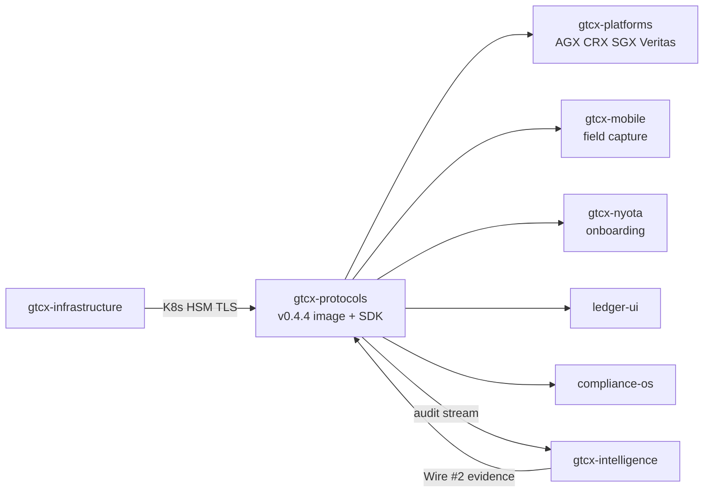

# Ecosystem integrations

`gtcx-protocols` is the **specification and reference implementation**. Production HTTP scale lives in **GTCX Cloud / Sovereign** deployments consumed by ecosystem repos.

## Consumer map

## gtcx-platforms

- **Product truth:** [ADR-007](https://github.com/gtcx-ecosystem/gtcx-platforms/blob/main/01-docs/architecture/decisions/ADR-007-two-product-consolidation.md) — **GTCX Cloud** (multi-tenant SaaS) + **GTCX Sovereign** (one government deploy).
- **Consumes:** `@gtcx/sdk`, REST `/v1/*`, legacy [platform-compat routes](https://github.com/gtcx-ecosystem/gtcx-protocols/blob/main/01-docs/05-audit/gtcx-platforms-integration-spec.md) during migration.
- **Your action:** Pin server `0.4.4`; migrate `protocol-client` from local stubs to npm SDK `0.4.x`.
- **Jurisdiction:** New geography = config (`JurisdictionConfigService` + CSP), not new protocol code.

## gtcx-mobile

- **Consumes:** `@gtcx/sdk`, signed mobile-auth requests, per-tenant SSE audit stream, TradeCV registry.
- **Your action:** Align mobile release branch to SDK `0.4.x`; use authority DID JSON-LDs from CSP bundles for jurisdiction config.
- **Jurisdiction:** Authority DIDs and regulator config come from the active CSP for each `X-GTCX-Tenant-Id` (`<iso>`). Multiple jurisdictions can be in flight in parallel.

## gtcx-nyota

- **Consumes:** Cloud tenant provisioning, API keys, jurisdiction selection.
- **Your action:** Document tenant → `X-GTCX-Tenant-Id` → CSP mapping in nyota onboarding; point operators to [Getting started](../getting-started.md).

## gtcx-intelligence

- **Produces:** Sentinel evidence (Wire #2) into TradePass verification path.
- **Consumes:** Signed audit stream, schema-forge provenance.
- **Your action:** Verify evidence signatures against keys published in the ratified CSP.

## gtcx-infrastructure

- **Provides:** Kubernetes manifests, TLS, staging URLs, HSM ceremony (`#49–54`).
- **Your action:** Deploy [pinned digest](../release/compatibility-matrix.md) from Release artifact `k8s-deployment-pinned`.

## Version discipline

| Breaking change | Protocol |
| --------------- | -------- |
| SDK major | Cross-repo paper trail + two-week lead |
| REST `/v1` route | Deprecation header for two minor releases |
| CSP | Per-jurisdiction semver bump + ratification |

## Related

- [Compatibility matrix](../release/compatibility-matrix.md)
- [Integration guide](../integration-guide.md)
- [API overview](../api/overview.md)
